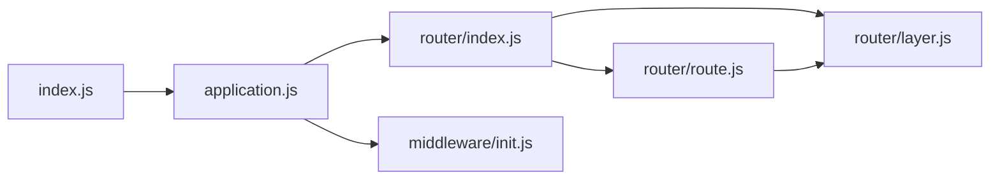

# Example: Running CodeDoc Agent on `expressjs/express`

This document shows example output from running:
```bash
codedoc analyze https://github.com/expressjs/express -o ./express-docs
```

---

## Terminal Output

```
  ██████╗ ██████╗ ██████╗ ███████╗██████╗  ██████╗  ██████╗
 ██╔════╝██╔═══██╗██╔══██╗██╔════╝██╔══██╗██╔═══██╗██╔════╝
 ██║     ██║   ██║██║  ██║█████╗  ██║  ██║██║   ██║██║
 ██║     ██║   ██║██║  ██║██╔══╝  ██║  ██║██║   ██║██║
 ╚██████╗╚██████╔╝██████╔╝███████╗██████╔╝╚██████╔╝╚██████╗
  ╚═════╝ ╚═════╝ ╚═════╝ ╚══════╝╚═════╝  ╚═════╝  ╚═════╝

  Automated Codebase Documentation & Refactoring Agent  v1.0.0

✔ Repository resolved: /tmp/codedoc-express-1718200000000
✔ Analysis complete: 34 files, 8,421 lines
✔ Dependency map: 34 modules, 67 connections
✔ Documentation generated: 4 doc files
✔ Refactoring: 12 suggestions found
✔ Exported successfully to ./express-docs

━━━━━━━━━━━━━━━━━━━━━━━━━━━━━━━━━━━━━━━━━━━━━━━━━
  📊 ANALYSIS SUMMARY
━━━━━━━━━━━━━━━━━━━━━━━━━━━━━━━━━━━━━━━━━━━━━━━━━
  Files analyzed:    34
  Lines of code:     8,421
  Doc files created: 4
  Issues found:      18
  Refactor hints:    12 (0 critical, 3 high)
  Code health:       B
━━━━━━━━━━━━━━━━━━━━━━━━━━━━━━━━━━━━━━━━━━━━━━━━━

  ✅ Output saved to: /Users/dev/express-docs
  Open: /Users/dev/express-docs/index.html
```

---

## Sample: Generated Project Overview

```markdown
## Project Overview

Express is a minimal, unopinionated web application framework for Node.js,
inspired by the Ruby framework Sinatra. It provides a robust set of features
for building single-page, multi-page, and hybrid web applications without
prescribing how you should structure your code.

The architecture follows a middleware-chain pattern: incoming HTTP requests
traverse a pipeline of composable middleware functions before reaching a
route handler. This design enables clean separation of concerns — logging,
authentication, body parsing, and routing are all independently composable
units.

## Architecture Summary

Express centers around the `Application` class (`lib/application.js`), which
orchestrates the middleware stack and routing engine. The `Router` acts as
a mini-application capable of performing middleware and routing functions.
Route definitions map to `Layer` objects within the router's stack.

## Technology Stack

| Component | Technology |
|-----------|-----------|
| Runtime | Node.js |
| HTTP | Node.js `http` module |
| Routing | Custom router (lib/router/) |
| Middleware | Connect-compatible |
| Testing | Mocha + SuperTest |
```

---

## Sample: Refactoring Suggestion

```markdown
### [HIGH] Large File (423 lines)

**File:** `lib/application.js`
**Type:** large_file

lib/application.js has 423 lines, making it hard to maintain.

**Suggestion:** Split into multiple focused modules. Single Responsibility Principle:
each file should have one reason to change.

**Before:**
```js
// 423-line file with 18 functions
```

**After:**
```js
// Split into:
// lib/application/settings.js  — app.set(), app.get() 
// lib/application/rendering.js — app.render(), app.engine()
// lib/application/routing.js   — app.use(), app.route()
```
```

---

## Sample: Dependency Map (Mermaid)


